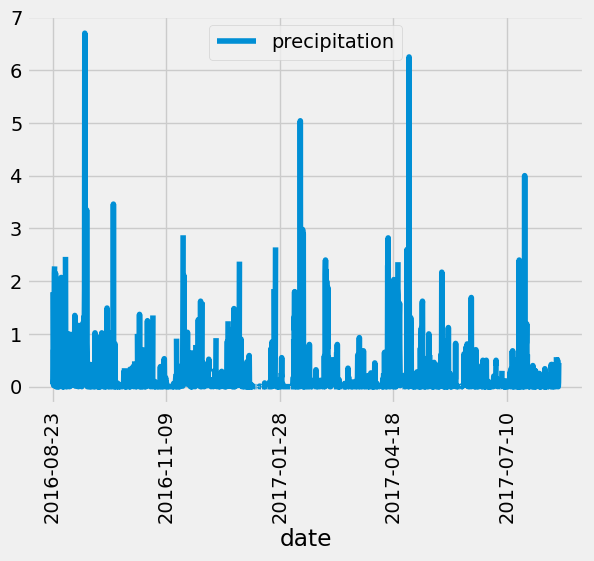
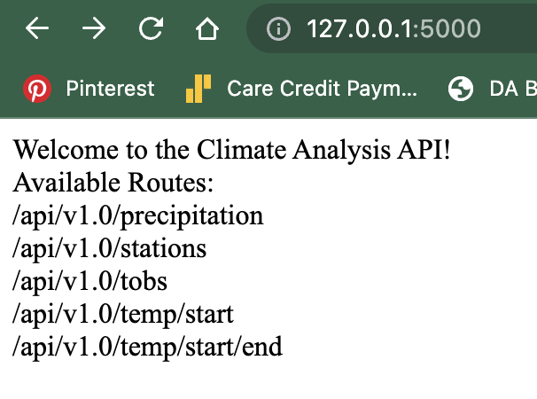

# SqlAlchemy-Challenge

## Congratulations! 
## You've decided to treat yourself to a long holiday vacation in Honolulu, Hawaii. To help with your trip planning, you decide to do a climate analysis about the area.

To start our analysis, we grabbed the latest date in the classes and retrieved the last 12 months of precipitation data and plotted the results. This gave us a visual and a time frame for the percipitation levels. Based off the visual, we can predict around september/fall season and the spring season is when it Honolulu has the most precipitation levels. Based off this analysis, we can say the best time to visit Hawaii is summer season. 

Then, we created an html with api routes to allow us to search for more specified precipitation, stations, and more specified time frames.

